# Multi-Tenancy Architecture

This document describes the multi-tenancy implementation used in the Go Clean Boilerplate. We use a **"Global User, Local Member"** strategy combined with **Row-Level Security (RLS)** via GORM scopes to ensure strict data isolation between organizations.

## 1. Core Concept: Global User, Local Member

The architecture distinguishes between a user's identity (who they are) and their membership (what they can access).

### Entities

1.  **User (Global)**:
    - Represents the human identity (Email, Password, Name).
    - Existing in the `users` table.
    - Can belong to multiple organizations.
    - **Authentication** validates the _User_.

2.  **Organization (Tenant)**:
    - Represents the tenant/workspace.
    - Has a unique `slug` for URL-friendly identification (e.g., `/orgs/acme-corp`).
    - Owned by a specific User (Owner).

3.  **Member (Link)**:
    - The association between a User and an Organization.
    - Contains the **Role** specific to that organization (e.g., `Admin`, `Member`, `Viewer`).
    - **Authorization** checks the _Member_ status.

### Relationship Diagram

```mermaid
erDiagram
    User ||--o{ Member : has
    Organization ||--o{ Member : has
    Organization ||--o{ Project : owns

    User {
        uuid id PK
        string email
        string password
    }

    Organization {
        uuid id PK
        string name
        string slug
        uuid owner_id
    }

    Member {
        uuid id PK
        uuid user_id FK
        uuid organization_id FK
        string role "admin|member|viewer"
    }

    Project {
        uuid id PK
        uuid organization_id FK
        string name
    }
```



## 2. Security & Isolation Strategy

We rely on **Middleware** and **Database Scopes** to enforce isolation.

### 2.1. Tenant Middleware

The `TenantMiddleware` runs on every request to a tenant-specific route (e.g., `/api/v1/organizations/:org_id/*`).

**Responsibilities:**

1.  **Extract Context**: Reads `X-Org-ID` header or URL parameter.
2.  **Validate Membership**: Checks if the authenticated `User` is a `Member` of the target `Organization`.
    - Uses **Redis Caching** to minimize DB lookups for frequent checks.
3.  **Enforce Ban/Status**: Rejects requests if the member is banned or inactive.
4.  **Inject Context**: Sets the `organization_id` in the request context for downstream controllers.

### 2.2. GORM Scopes (Row-Level Security)

To prevent accidental data leaks, _every_ database query within a tenant context must apply a scope.

**Implementation:**

```go
// Scope to filter by Organization ID
func ScopeOrganization(orgID string) func(db *gorm.DB) *gorm.DB {
    return func(db *gorm.DB) *gorm.DB {
        return db.Where("organization_id = ?", orgID)
    }
}

// Repository usage
func (r *ProjectRepository) FindAll(ctx context.Context, orgID string) ([]Project, error) {
    var projects []Project
    // The scope guarantees we only get projects for this org
    err := r.db.Scopes(ScopeOrganization(orgID)).Find(&projects).Error
    return projects, err
}
```

## 3. Implementation Details

### Membership Roles

Roles within an organization are distinct from system-level roles (`role:admin`, `role:user`).

| Org Role   | Capabilities                                                          |
| :--------- | :-------------------------------------------------------------------- |
| **Owner**  | Full control. Can delete the organization. Cannot be removed.         |
| **Admin**  | Can manage members (invite/kick), update settings. Cannot delete org. |
| **Member** | Standard access. Can create projects/resources.                       |
| **Viewer** | Read-only access to resources.                                        |

### Invitation Flow

1.  **Admin** sends invite to an email (`POST /api/v1/organizations/:id/members/invite`).
2.  **System** generates a signed JWT invitation token (expires in 48h).
3.  **User** clicks link and calls `POST /api/v1/organizations/invitations/accept` with the token.
4.  **System** adds the User as a Member of the Organization.

## 4. Testing Pattern

We use specific patterns to verify multi-tenancy security:

1.  **Header Spoofing**: Verify that providing a valid `X-Org-ID` without actual membership returns `403 Forbidden`.
2.  **Cross-Tenant Access**: Verify that a valid member of Org A cannot access resources of Org B, even if they guess the ID.
3.  **Scope Verification**: Integration tests must ensure `Where("organization_id = ?")` is present in generated SQL.

---

_This architecture ensures that while users are global (for ease of login), their data and access are strictly compartmentalized by Organization._
