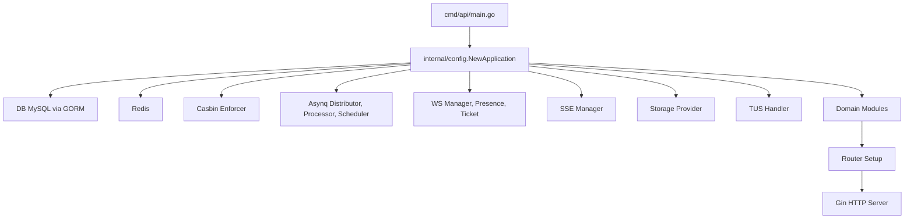
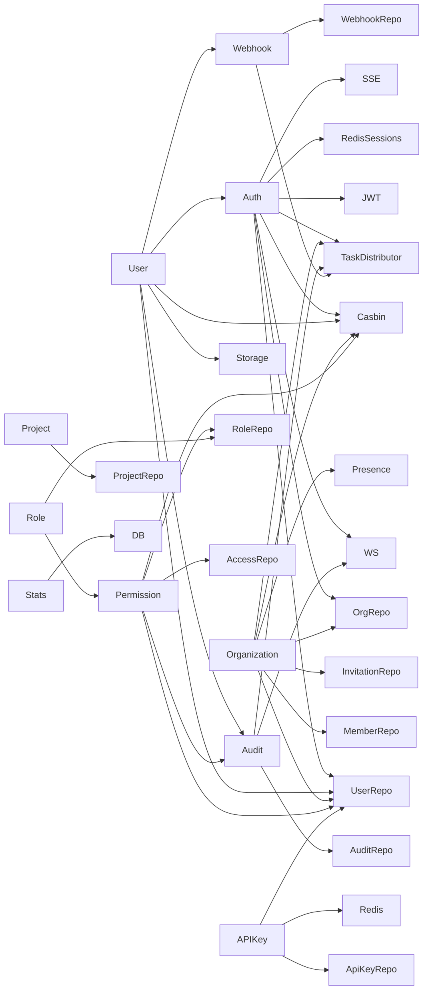
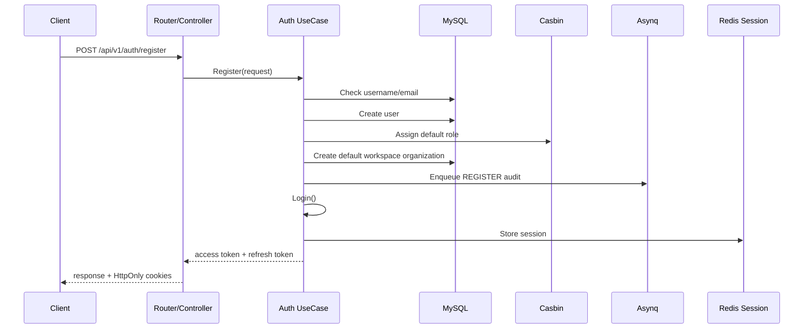
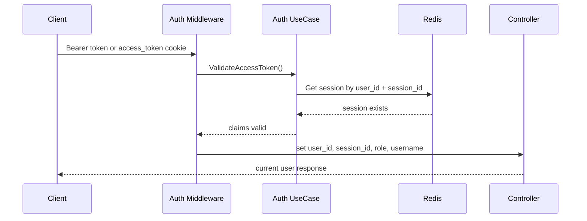
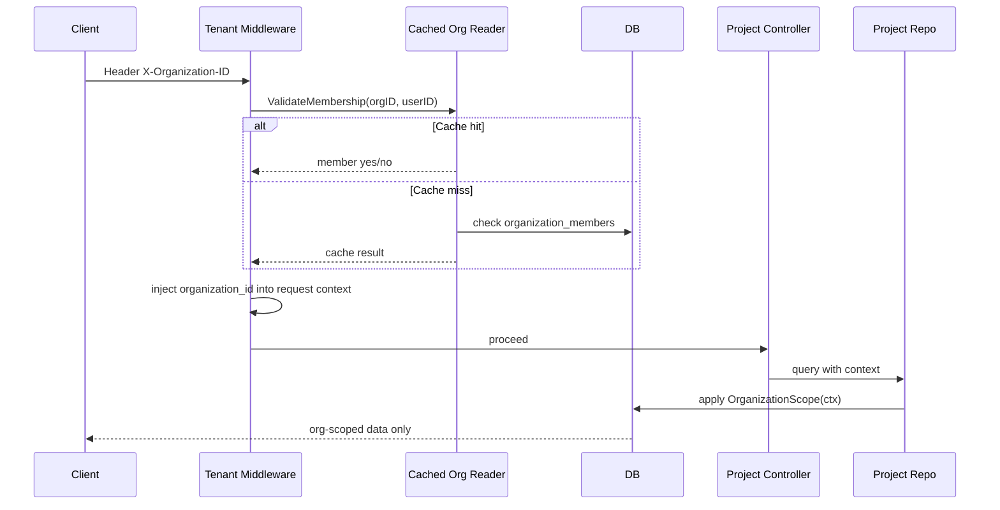
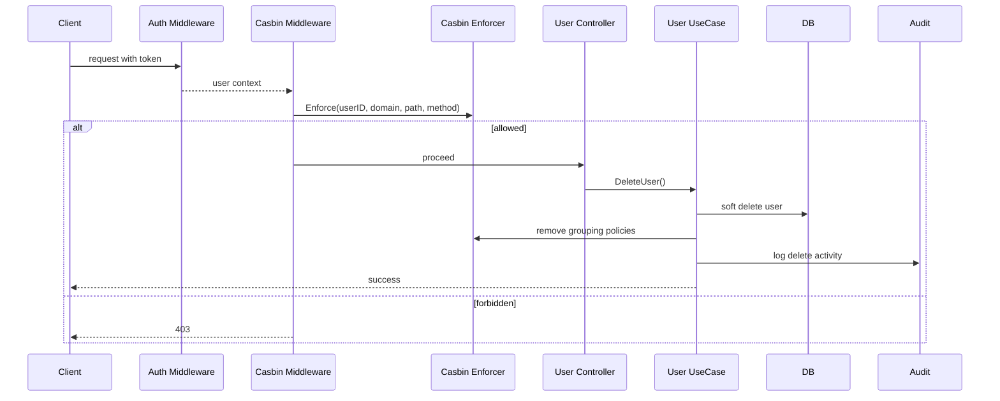
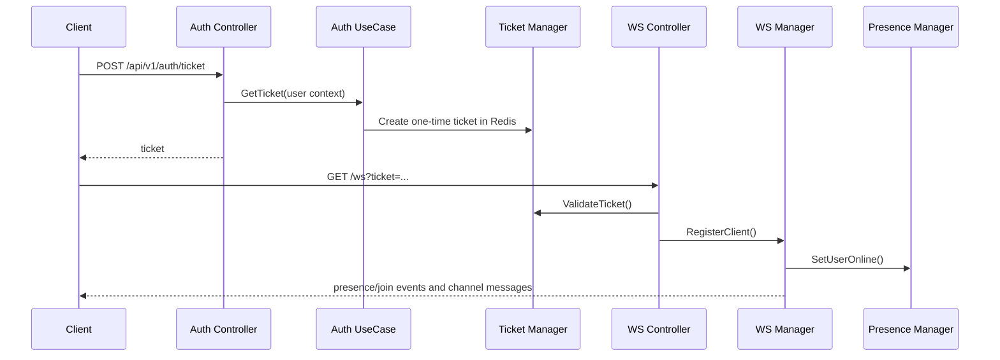
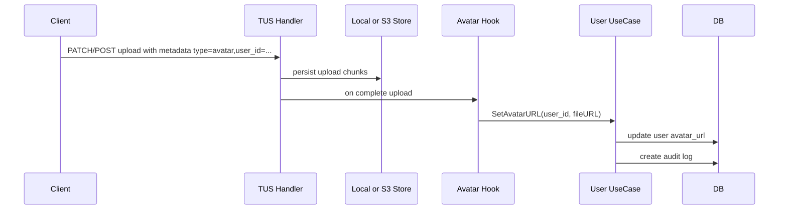

# Project Analysis E2E

Dokumen ini merangkum arsitektur, dependency map, fitur utama, dan flow logic end-to-end untuk backend Go di repository ini.

## 1. High-Level View

## 2. Runtime Composition

Entry point:

- `cmd/api/main.go`

Composition root:

- `internal/config/app.go`

Komponen runtime yang diinisialisasi:

- Logger
- MySQL/GORM
- Redis
- JWT manager
- Casbin enforcer + transactional wrapper
- WebSocket manager + presence manager + ticket manager
- SSE manager
- Storage provider (`local` atau `s3`)
- TUS resumable upload handler
- Asynq task distributor, worker processor, scheduler
- Semua domain module

## 3. Clean Architecture Layout

Setiap module di `internal/modules/<name>/` umumnya dibagi menjadi:

- `entity/`: representasi domain inti
- `model/`: request/response DTO
- `repository/`: akses data
- `usecase/`: business logic
- `delivery/http/`: controller dan route registration

Module utama:

- `auth`
- `user`
- `organization`
- `permission`
- `role`
- `access`
- `audit`
- `project`
- `api_key`
- `stats`
- `webhook`

## 4. Dependency Map

## 5. Route Grouping Model

Router utama ada di `internal/router/router.go`.

### Public

- `/api/v1/auth/login`
- `/api/v1/auth/register`
- `/api/v1/auth/refresh`
- `/api/v1/auth/forgot-password`
- `/api/v1/auth/reset-password`
- `/api/v1/auth/verify-email`
- `/api/v1/auth/sso/:provider`
- `/api/v1/auth/sso/:provider/callback`
- `/api/v1/users/register`
- `/api/v1/organizations/invitations/accept`

### Authenticated

Middleware:

- optional API key auth
- JWT validation
- user status validation

Contoh endpoint:

- `/api/v1/auth/logout`
- `/api/v1/auth/ticket`
- `/api/v1/auth/me`
- `/api/v1/stats/*`
- `/api/v1/users/me`
- `/api/v1/organizations/me`
- `/api/v1/api-keys/*`
- `/api/v1/permissions/check-batch`

### Tenant

Middleware:

- optional API key auth
- JWT validation
- `TenantMiddleware.RequireOrganization()`

Contoh endpoint:

- `/api/v1/organizations/:id/members/*`
- `/api/v1/organizations/:id/presence`
- `/api/v1/projects/*`

### Authorized

Middleware:

- optional API key auth
- JWT validation
- user status validation
- Casbin authorization

Contoh endpoint:

- `/api/v1/permissions/*`
- `/api/v1/access-rights/*`
- `/api/v1/endpoints/*`
- `/api/v1/roles/*`
- `/api/v1/users/*`
- `/api/v1/audit-logs/*`
- `/api/v1/webhooks/*`

## 6. Cross-Cutting Middleware Flow

```mermaid
flowchart LR
    A[HTTP Request] --> B[Request ID]
    B --> C[Metrics or OTEL]
    C --> D[Request Logger]
    D --> E[Recovery]
    E --> F[Security Headers]
    F --> G[CORS]
    G --> H[Rate Limiter]
    H --> I[API Key Middleware]
    I --> J[Auth Middleware]
    J --> K[User Status Middleware]
    K --> L[Tenant Middleware]
    L --> M[Casbin Middleware]
    M --> N[Controller]
    N --> O[UseCase]
    O --> P[Repository]
```

Catatan:

- Tidak semua request melewati semua middleware.
- Tenant dan Casbin hanya aktif pada route group tertentu.

## 7. E2E Flow: Register and Login

### Register

### Login

- Validasi body
- Cek account lock di Redis
- Ambil user dari DB
- Verifikasi password
- Reset atau increment login attempts
- Ambil role user dari Casbin
- Generate token pair
- Simpan session di Redis
- Kirim audit async
- Broadcast event login ke WS/SSE

## 8. E2E Flow: Authenticated Request

Contoh `GET /api/v1/auth/me`:

## 9. E2E Flow: Tenant-Scoped Request

Contoh `GET /api/v1/projects`:

## 10. E2E Flow: Casbin Authorization

Contoh `DELETE /api/v1/users/:id`:

## 11. E2E Flow: Organization Membership Lifecycle

### Invite Member

- Caller harus masuk tenant route dan lolos membership check.
- Use case cek organization.
- Cari user by email.
- Jika belum ada, buat shadow user berstatus `invited`.
- Buat atau reuse member record berstatus `invited`.
- Generate invitation token.
- Simpan invitation token.
- Queue email invitation via Asynq.

### Accept Invitation

- Cari token invitation.
- Validasi expiry.
- Ambil user dari email invitation.
- Jika shadow user, set password dan aktivasi user.
- Ubah member status ke `active`.
- Tambah Casbin grouping policy pada domain organization.
- Hapus invitation token.

## 12. E2E Flow: API Key

### Create

- Route butuh auth dan tenant context.
- Generate secure random key.
- Hash dengan SHA-256.
- Simpan hash di DB.
- Return raw key sekali saja ke client.

### Use

- Client kirim `X-API-Key`.
- Middleware resolve identity via Redis cache atau DB.
- Inject `user_id`, `organization_id`, `username`.
- Request lanjut ke middleware berikutnya.

## 13. E2E Flow: Realtime

### WebSocket

### SSE

- Client connect ke `/events` dengan token valid.
- SSE manager register client.
- Event internal dapat di-broadcast ke semua subscriber SSE.

## 14. E2E Flow: Audit Logging

### Non-transactional event

- Use case memanggil `AuditUC.LogActivity()`
- Audit langsung ditulis ke `audit_logs`
- Event dikirim ke channel `audit` via WS

### Transactional event

- Jika ada transaction context, audit masuk ke `audit_outbox`
- Scheduler enqueue task sync audit outbox tiap 5 detik
- Worker membaca outbox dan memindahkan ke audit log final

## 15. E2E Flow: TUS Upload Avatar

## 16. E2E Flow: Background Worker

Task yang terlihat di code:

- send email
- create audit log
- export audit log
- sync audit outbox
- webhook trigger
- cleanup expired reset tokens
- cleanup soft-deleted users
- prune old audit logs

Jadwal default:

- cleanup expired tokens: tiap 6 jam
- hard delete soft-deleted users: tiap hari jam 03:00
- prune audit logs: mingguan
- audit outbox sync: tiap 5 detik

## 17. Data and Infra Boundaries

MySQL dipakai untuk:

- users
- roles
- casbin_rule
- access_rights dan endpoints
- organizations dan organization_members
- audit_logs dan audit_outbox
- password reset tokens
- email verification tokens
- projects
- user_sso_identities
- api_keys
- webhooks

Redis dipakai untuk:

- JWT session storage
- login attempts dan account lock
- API key cache
- tenant membership cache
- WebSocket presence
- WebSocket ticket
- Asynq broker/backend
- optional distributed WS/Casbin sync

## 18. Strengths

- Composition root cukup jelas.
- Modular separation cukup konsisten.
- Session JWT dibuat stateful, jadi revoke praktis.
- Multi-tenancy sudah ditanamkan ke middleware dan repository scope.
- RBAC cukup kaya: role inheritance, access-right abstraction, matrix aggregation.
- Realtime, async worker, upload resumable, dan storage abstraction sudah terintegrasi.
- Test coverage secara kategori cukup luas: unit, integration, e2e, scenario.

## 19. Important Gaps and Risks

### SSO flow mismatch

- Flow SSO tampak tidak konsisten antara token yang dihasilkan, session yang disimpan, dan nilai return ke controller.
- Risiko: cookie atau session SSO invalid.

### Organization route protection masih longgar

- Beberapa route organization berada di group `authenticated`, bukan `tenant` atau role-checked route.
- Risiko: akses org detail/update tanpa membership/role enforcement yang cukup ketat.

### Member management belum enforce org-role

- Invite/update/remove member saat ini hanya ditahan oleh membership tenant, bukan owner/admin role.
- Risiko: member biasa bisa melakukan operasi administrasi.

### Stats route tidak tenant-aware secara efektif

- Use case stats mendukung org scope, tetapi route stats tidak memaksa tenant context.
- Hasil aktual cenderung global.

### Membership cache invalidation belum terlihat dipanggil

- Setelah update member/remove member, cache membership bisa stale sampai TTL habis.

## 20. Suggested Mental Model

Cara paling tepat memahami project ini:

- Anggap ini sebagai modular monolith.
- `auth` adalah pintu masuk identitas dan session.
- `organization` adalah boundary multi-tenant.
- `permission` + `role` + `access` adalah mesin RBAC.
- `audit`, `worker`, `webhook`, `ws`, `sse`, `tus` adalah cross-cutting platform capability.
- `user`, `project`, `api_key`, `stats` adalah domain feature di atas fondasi itu.

## 21. Quick File Map

File paling penting untuk dibaca berurutan:

- `README.md`
- `documentation/ARCHITECTURE.md`
- `cmd/api/main.go`
- `internal/config/app.go`
- `internal/router/router.go`
- `internal/middleware/auth_middleware.go`
- `internal/middleware/tenant_middleware.go`
- `internal/middleware/casbin_middleware.go`
- `internal/modules/auth/usecase/auth_usecase.go`
- `internal/modules/organization/usecase/organization_member_usecase.go`
- `internal/modules/permission/usecase/permission_usecase.go`
- `internal/modules/user/usecase/user_usecase.go`
- `internal/worker/processor.go`
- `pkg/ws/ws_manager.go`
- `pkg/tus/handler.go`

## 22. Summary

Secara keseluruhan, project ini adalah backend monolith modular dengan fondasi yang cukup kuat:

- arsitektur bersih
- dependency injection manual
- multi-tenancy
- RBAC berbasis Casbin
- session management berbasis Redis
- audit logging sinkron dan async
- realtime channel
- async jobs
- storage abstraction

Yang paling penting untuk dijaga ke depan adalah konsistensi boundary authorization:

- bedakan dengan tegas antara `authenticated`, `tenant`, dan `authorized`
- pastikan org-role benar-benar dipakai untuk operasi administrasi tenant
- rapikan flow SSO dan invalidation cache membership
