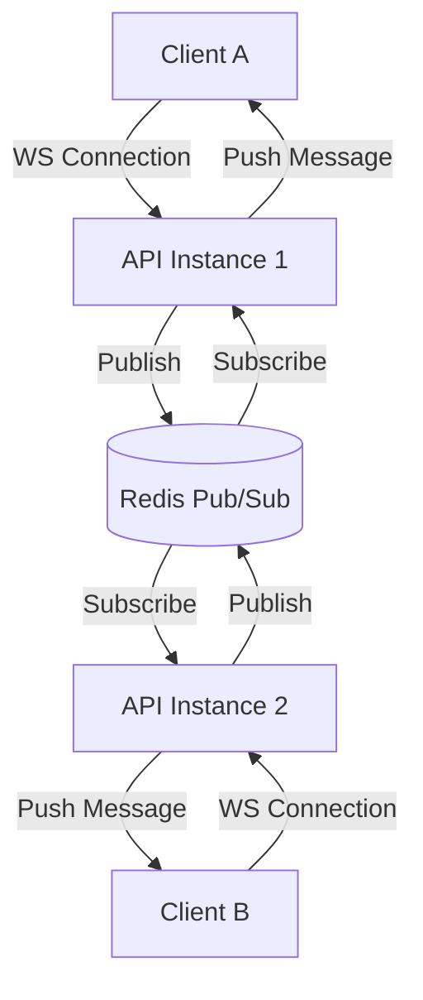

# Distributed WebSocket Usage Guide

The project implements a scalable, distributed WebSocket architecture using **Redis Pub/Sub** as a message backplane. This allows multiple API instances to broadcast messages to connected clients regardless of which instance they are connected to.

## 🏗 Architecture



### Key Components
1.  **WebSocket Manager (`pkg/ws/ws_manager.go`)**: Handles client connections, heartbeats, and message routing.
2.  **Redis Broadcaster**: Subscribes to a global Redis channel (`ws_broadcast:global_notifications`) and forwards messages to local WebSocket clients.
3.  **Client (`pkg/ws/ws_client.go`)**: Represents a single connected user.

## 📦 Deployment Modes

### 1. Single Instance Mode
If running a single server instance (e.g., local dev), you can disable Redis Pub/Sub to save resources. Messages are broadcasted directly in-memory.

**Config:**
```env
WEBSOCKET_DISTRIBUTED_ENABLED=false
```

### 2. Distributed Mode
If running multiple replicas (e.g., Kubernetes), you **MUST** enable this. Without it, a message sent from Server A will NOT reach clients connected to Server B.

**Config:**
```env
WEBSOCKET_DISTRIBUTED_ENABLED=true
# Ensure all instances connect to the same Redis
REDIS_ADDR=shared-redis:6379
```

## 🚀 How to Use

### 1. Connecting (Frontend)
Connect to the WebSocket endpoint. Authentication is required (JWT Query Param or Cookie).

```javascript
const socket = new WebSocket("ws://localhost:8080/ws?token=YOUR_JWT_TOKEN");

socket.onmessage = (event) => {
    const msg = JSON.parse(event.data);
    console.log("Received:", msg);
};
```

### 2. Broadcasting (Backend)
Inject `ws.Manager` into your UseCase or Controller and use `BroadcastToChannel`.

```go
// In a UseCase or Controller
func (uc *YourUseCase) NotifyUsers(message string) {
    // This message will be sent to ALL connected clients on ALL instances
    notification := map[string]string{
        "type": "alert",
        "body": message,
    }
    jsonMsg, _ := json.Marshal(notification)
    
    // Broadcast via Redis
    uc.wsManager.BroadcastToChannel("global_notifications", jsonMsg)
}
```

## ⚙️ Configuration

Configure the behavior in `.env`:

```env
# WebSocket Settings
WEBSOCKET_DISTRIBUTED_ENABLED=true  # Enable Redis Pub/Sub
WEBSOCKET_REDIS_PREFIX=ws_broadcast:
```

## 🧪 Testing
Use the Postman collection `postman/Casbin Project API - Realtime.postman_collection.json` to verify connectivity and message receipt.
