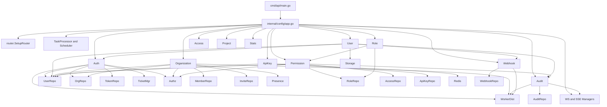

# Module Map and Dependency Relations

Dokumen ini memetakan semua modul utama, shared services, dan relasi di antara keduanya berdasarkan wiring aktual di `internal/config/app.go`.

## Gambaran Umum

Sistem ini tersusun dari tiga lapisan besar:

- runtime and infrastructure
- business modules
- delivery and middleware

Di luar itu ada jalur asynchronous dan realtime yang ikut memengaruhi perilaku request.

## Runtime and Infrastructure

Komponen runtime yang dibangun saat startup:

- `gorm.DB`
- `redis.Client`
- `logrus.Logger`
- validator
- transaction manager
- JWT manager
- Casbin enforcer
- storage provider
- WebSocket manager
- presence manager
- ticket manager
- SSE manager
- task distributor
- task processor
- scheduler
- SSO providers

## Business Modules

### auth

Tanggung jawab:

- register
- login
- refresh token
- session verification and revocation
- forgot/reset password
- email verification
- websocket ticket issuance
- SSO callback flow

Dependency utama:

- user repository
- organization repository
- token repository
- transaction manager
- notification publisher
- authz manager
- worker distributor
- ticket manager
- SSO providers

### user

Tanggung jawab:

- CRUD user
- current profile
- status update
- avatar handling
- soft delete and cleanup hooks

Dependency utama:

- user repository
- transaction manager
- enforcer
- audit usecase
- auth usecase
- webhook usecase
- storage provider

### organization

Tanggung jawab:

- create/update/delete organization
- member management
- invitation flow
- cached membership validation
- presence lookup by organization

Dependency utama:

- organization repository
- member repository
- invitation repository
- user repository
- transaction manager
- enforcer
- presence reader
- worker distributor

### permission

Tanggung jawab:

- assign role to user
- revoke role
- grant/revoke permission
- role inheritance
- batch permission check
- access-right assignment
- permission matrix and inheritance tree

Dependency utama:

- transactional enforcer
- role repository
- user repository
- access repository
- audit usecase

### role

Tanggung jawab:

- create/update/delete role
- list role
- cleanup role policies when deleting role

Dependency utama:

- role repository
- transaction manager
- permission usecase

### access

Tanggung jawab:

- endpoint registry
- access-right registry
- logical grouping of physical endpoints

Dependency utama:

- access repository

### audit

Tanggung jawab:

- log activity
- export logs
- audit outbox
- audit broadcast

Dependency utama:

- audit repository
- websocket manager
- worker distributor

### api_key

Tanggung jawab:

- create API key
- list API keys
- revoke API key
- authenticate API key

Dependency utama:

- api key repository
- user repository
- Redis cache

### webhook

Tanggung jawab:

- manage webhook configs
- dispatch webhook events asynchronously
- retrieve webhook logs

Dependency utama:

- webhook repository
- worker distributor
- validator

### project

Tanggung jawab:

- create/list/update/delete project in tenant scope

Dependency utama:

- project repository

### stats

Tanggung jawab:

- dashboard summary
- activity trend
- system insight summary

Dependency utama:

- gorm DB

## Shared Services and Cross-Cutting Concerns

### transaction manager

Semua usecase yang perlu atomicity memakai `WithinTransaction(ctx, fn)`.

Efek penting:

- DB transaction diinjeksikan lewat context
- Casbin transactional enforcer bisa ikut transaksi
- audit bisa berubah dari direct write menjadi outbox write

### transactional enforcer

Ini jembatan antara DB transaction dan policy mutation.

Dipakai untuk:

- create organization plus owner role assignment
- role change in organization
- default role assignment

### Redis

Redis dipakai untuk beberapa concern sekaligus:

- auth session store
- login attempt lockout
- worker backend
- presence state
- websocket ticket
- cached membership validation
- API key cache
- optional distributed rate limit

### worker system

Asynq membagi sistem menjadi dua jalur:

- request path
- async side-effect path

Task penting:

- email
- audit log create/export
- audit outbox sync
- webhook trigger
- cleanup jobs

### realtime stack

Ada dua jalur:

- WebSocket manager untuk bidirectional communication dan presence
- SSE manager untuk one-way push

Keduanya dihubungkan ke business event tertentu seperti login dan audit.

## Dependency Direction

Secara logis arah ketergantungannya seperti ini:

## Route Group to Module Mapping

Route grouping utama di router:

- public auth routes -> `auth`
- authenticated user routes -> `auth`, `user`, `organization`, `stats`, `api_key`
- tenant routes -> `organization`, `project`
- authorized routes -> `permission`, `access`, `role`, `user`, `audit`, `webhook`
- upload routes -> `user` via TUS hook
- realtime routes -> WS controller and SSE manager

## Modul yang Paling Sentral

Modul paling sentral secara dependency dan value bisnis:

1. `auth`
2. `organization`
3. `permission`
4. `audit`
5. `user`

Alasan:

- `auth` membuka semua akses awal.
- `organization` mendefinisikan tenant boundary.
- `permission` menentukan governance policy.
- `audit` mengikat compliance dan observability.
- `user` menjadi identity record yang dipakai semua flow.

## Modul yang Masih Peripheral

Modul yang lebih berfungsi sebagai pelengkap atau consumer dari core platform:

- `project`
- `stats`
- `webhook`
- `api_key`

Mereka tetap penting, tetapi tidak membentuk fondasi keamanan dan tenancy seperti empat modul inti di atas.

## Kesimpulan

Codebase ini bukan sekadar kumpulan endpoint. Ia adalah sistem dengan core graph yang cukup jelas:

- `auth` mengelola identity dan session
- `organization` mengelola tenant membership
- `permission` mengelola governance
- `audit` mengelola jejak operasional
- sisanya memperkaya platform melalui integrasi, resource, dan observability
