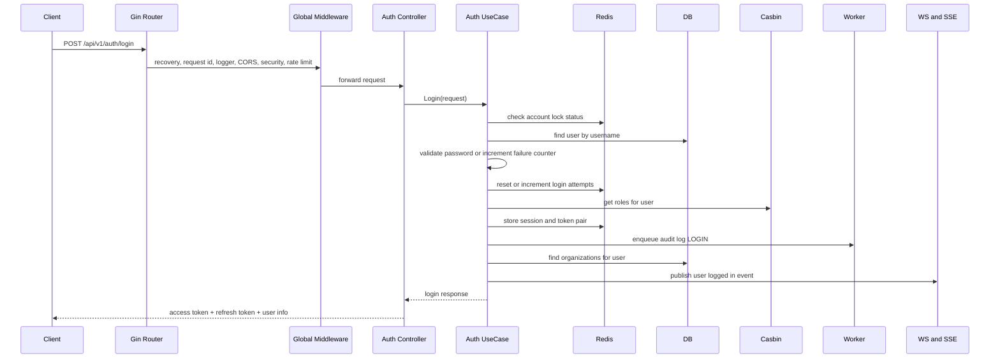
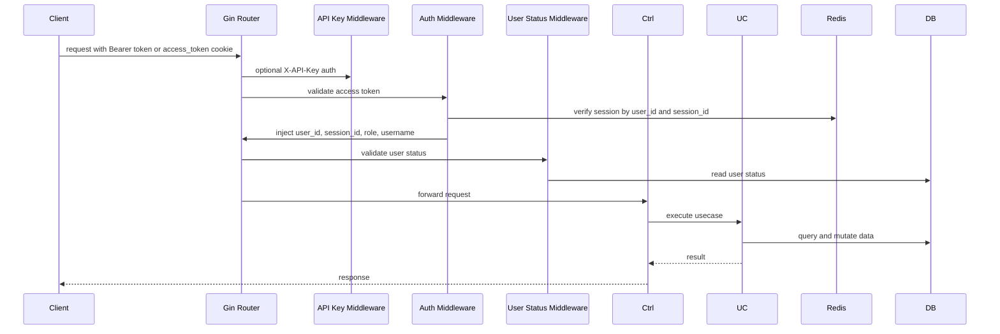
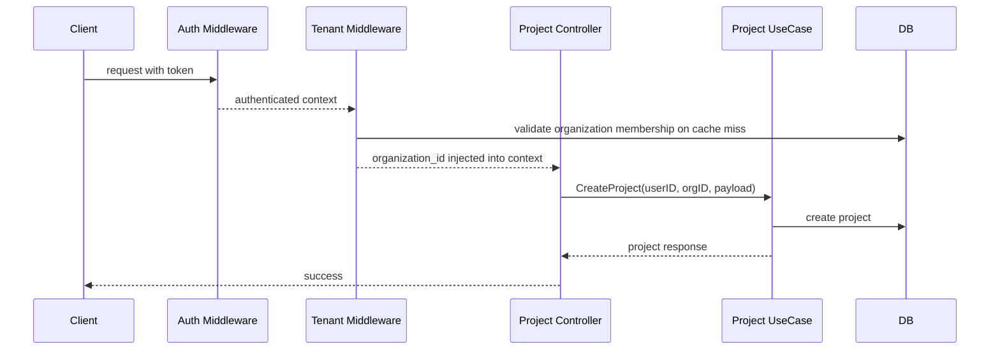

# End-to-End Request Flows

Dokumen ini menjelaskan flow request utama dari masuk ke router sampai side effect yang terjadi, termasuk middleware, tenant context, Redis, DB, worker, realtime, dan authorization.

## Flow 1: Public Authentication Request

Contoh endpoint:

- `POST /api/v1/auth/login`
- `POST /api/v1/auth/register`
- `POST /api/v1/auth/refresh`

### Login

Poin penting:

- Login tidak cukup valid secara password saja.
- Ada state Redis untuk lockout dan session.
- Ada side effect audit dan notification.

### Register

Flow register lebih kaya daripada login:

1. validasi uniqueness username dan email
2. hash password
3. transaction start
4. create user
5. assign default role
6. create default workspace or organization
7. add owner membership
8. enqueue audit REGISTER
9. commit transaction
10. jalankan login flow

Maknanya: satu request register menghasilkan provisioning identitas dan tenant awal.

## Flow 2: Authenticated Request

Contoh endpoint:

- `GET /api/v1/auth/me`
- `POST /api/v1/auth/logout`
- `GET /api/v1/stats/summary`

Poin penting:

- Authentication adalah kombinasi JWT validation plus session verification.
- API key bisa masuk sebagai jalur auth alternatif.
- Session invalidation di Redis membuat logout dan revoke all sessions efektif.

## Flow 3: Tenant-Scoped Request

Contoh endpoint:

- `POST /api/v1/projects`
- `GET /api/v1/organizations/:id/members`

### Tenant middleware path

1. request sudah lolos auth
2. middleware baca `X-Organization-ID` atau `X-Organization-Slug`
3. resolve slug ke org id bila perlu
4. cek membership user terhadap organization
5. cache hit di Redis jika tersedia
6. jika miss, fallback ke DB lalu cache hasil
7. inject `organization_id` ke request context
8. inject `member_role` ke Gin context
9. downstream repository memakai `database.OrganizationScope(ctx)`

### Project create flow

Poin penting:

- Tenant isolation terjadi sebelum business logic dijalankan.
- Repository yang taat pada scope akan otomatis terfilter organisasi.

## Flow 4: Authorized Admin Request with Casbin

Contoh endpoint:

- permission management
- access management
- role management
- audit log access
- webhook management

### Authorization path

1. request lolos API key or JWT auth
2. request lolos status validation
3. Casbin middleware ambil:
   - subject: `user_id`
   - domain: `organization_id` jika ada, else `global`
   - object: request path
   - action: HTTP method
4. enforcer menjalankan policy check
5. request diteruskan hanya bila allow

### Assign access right flow

1. controller menerima request assign access right
2. usecase lookup `access_right`
3. access right di-expand menjadi beberapa endpoint
4. untuk setiap endpoint, policy Casbin ditambahkan jika belum ada
5. audit activity dibuat
6. response dikembalikan

Ini menjelaskan kenapa permission layer di aplikasi ini lebih tinggi dari sekadar route protection biasa.

## Flow 5: Upload Request via TUS

Route:

- `/api/v1/upload/files/*`

Flow:

1. request lolos auth middleware
2. diteruskan ke TUS handler
3. TUS menyimpan file ke storage backend
4. registry hook menentukan jenis upload
5. untuk upload avatar, `AvatarHook` memanggil `UserUseCase.SetAvatarURL`
6. user profile diperbarui dengan file URL

Poin penting:

- upload path dipisah dari CRUD user biasa
- storage provider abstrak, jadi bisa local atau S3-compatible
- context storage ikut request context

## Flow 6: WebSocket Connection

Route:

- `GET /ws?ticket=...`

Flow:

1. client minta ticket lewat authenticated route `/auth/ticket`
2. ticket manager menyimpan ticket short-lived di Redis
3. client connect ke `/ws` dengan ticket
4. middleware validate ticket
5. user context dan optional organization context diinject
6. WS controller melakukan upgrade connection
7. connection didaftarkan ke WS manager
8. presence state diperbarui
9. broadcast dari node lain dapat diteruskan via Redis pub/sub

Poin penting:

- websocket tidak memakai access token langsung saat handshake
- ticket lebih aman untuk one-time handoff

## Flow 7: Async Side-Effect Path

Tidak semua business event selesai di request path.

Contoh:

- audit create
- send email invite
- webhook trigger
- audit outbox sync
- cleanup maintenance

Flow umum:

1. usecase membuat state utama di DB
2. usecase enqueue task ke Asynq
3. request selesai lebih cepat
4. worker processor memproses task
5. hasil side effect dicatat ke log atau DB

Ini menurunkan latency request sekaligus memisahkan heavy IO dari jalur API sinkron.

## Flow 8: Transaction-Backed Audit

Saat usecase berjalan dalam transaction context:

1. business mutation dijalankan
2. audit usecase mendeteksi ada DB transaction di context
3. audit tidak langsung menulis audit log final
4. audit membuat `audit_outbox`
5. transaction commit
6. scheduler enqueue outbox sync task
7. worker memindahkan outbox menjadi audit log final

Ini adalah pola penting untuk menjaga konsistensi antara data bisnis dan jejak audit.

## Kesimpulan

Flow request pada sistem ini tidak linear. Setiap request bisa melalui kombinasi:

- HTTP middleware
- JWT or API key auth
- tenant resolution
- Casbin authorization
- DB transaction
- Redis session and cache
- background worker
- realtime broadcast

Karena itu memahami flow di repository ini harus selalu dilakukan secara end-to-end, bukan per-layer saja.
