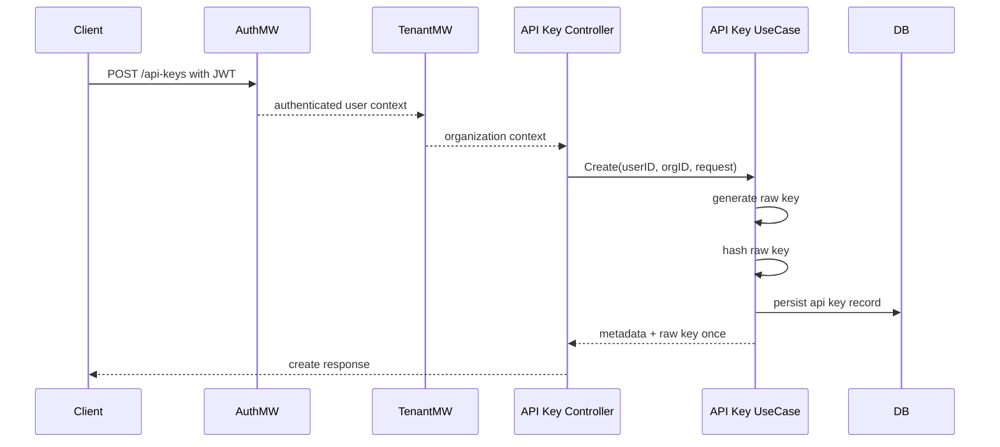
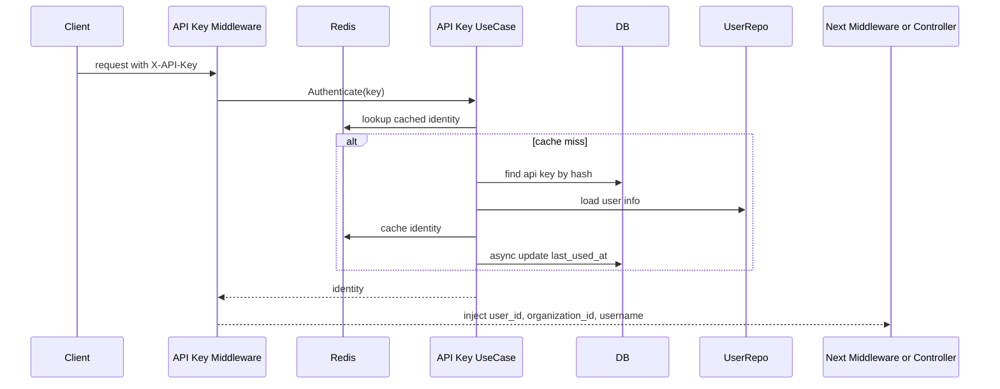

# API Key Feature Analysis

Dokumen ini menguraikan fitur `api_key` yang sudah ada di codebase, alur teknisnya, nilai bisnisnya, keterbatasannya, dan arah pengembangan yang disarankan.

## Ringkasan

Fitur `api_key` saat ini sudah mendukung:

1. create API key
2. list API key per organization
3. revoke API key
4. authenticate request via header `X-API-Key`
5. expiry check
6. scope storage sebagai metadata
7. cache Redis untuk identity lookup
8. last-used tracking

Kesimpulan singkat:

- modul ini sudah cukup untuk machine-to-machine authentication dasar
- modul ini belum matang sebagai authorization layer penuh
- gap terbesar ada pada enforcement `scopes`

## Lokasi Implementasi

File utama:

- [internal/modules/api_key/module.go](/home/user/Documents/Riset/Casbin/internal/modules/api_key/module.go)
- [internal/modules/api_key/delivery/http/api_key_routes.go](/home/user/Documents/Riset/Casbin/internal/modules/api_key/delivery/http/api_key_routes.go)
- [internal/modules/api_key/delivery/http/api_key_controller.go](/home/user/Documents/Riset/Casbin/internal/modules/api_key/delivery/http/api_key_controller.go)
- [internal/modules/api_key/usecase/api_key_usecase.go](/home/user/Documents/Riset/Casbin/internal/modules/api_key/usecase/api_key_usecase.go)
- [internal/modules/api_key/repository/api_key_repository.go](/home/user/Documents/Riset/Casbin/internal/modules/api_key/repository/api_key_repository.go)
- [internal/modules/api_key/model/api_key_model.go](/home/user/Documents/Riset/Casbin/internal/modules/api_key/model/api_key_model.go)
- [internal/middleware/api_key_middleware.go](/home/user/Documents/Riset/Casbin/internal/middleware/api_key_middleware.go)

## Fitur yang Sudah Ada

### 1. Create API Key

Request model:

- `name`
- `scopes`
- `expires_at`

Perilaku:

- raw key dibuat secara kriptografis aman
- key diberi prefix `sk_live_`
- yang disimpan di database hanya `hash`
- key mentah hanya dikembalikan sekali saat create
- key selalu terkait dengan `organization_id` dan `user_id`

Nilai:

- aman dari sisi penyimpanan credential
- cocok untuk integrasi service-to-service atau automation

### 2. List API Keys

Sistem bisa menampilkan semua key di organization aktif.

Metadata yang dikembalikan:

- id
- name
- organization_id
- user_id
- scopes
- expires_at
- last_used_at
- is_active
- created_at

Nilai:

- admin atau user bisa melihat kredensial yang telah dibuat
- mendukung governance dasar

### 3. Revoke API Key

Perilaku:

- key dicari berdasarkan `id`
- organization pemilik diverifikasi
- key dihapus
- cache Redis untuk key itu diinvalidasi

Nilai:

- mendukung pemutusan akses secara cepat

### 4. Authenticate by API Key

Perilaku:

- middleware membaca header `X-API-Key`
- prefix `sk_live_` dihapus bila ada
- key di-hash
- sistem cek Redis terlebih dahulu
- bila miss, sistem cek DB
- expiry diverifikasi
- user terkait diambil untuk melengkapi identity
- context request diisi dengan:
  - `user_id`
  - `organization_id`
  - `username`
  - `auth_method=api_key`
- `last_used_at` diupdate async
- identity di-cache 30 menit

Nilai:

- auth machine credential menjadi cepat
- request berikutnya tidak perlu hit DB setiap kali

## Route yang Tersedia

Route management:

- `POST /api-keys`
- `GET /api-keys`
- `DELETE /api-keys/:id`

Semua route ini:

- butuh JWT auth
- butuh organization context

Artinya management API key saat ini bukan self-service anonymous flow, tetapi dikelola oleh user yang sudah login dalam tenant.

## Flow End-to-End

### Create Flow

### Authenticate Flow

## Data Model

Entity `api_keys` menyimpan:

- `id`
- `name`
- `key_hash`
- `organization_id`
- `user_id`
- `scopes`
- `expires_at`
- `last_used_at`
- `is_active`
- timestamps
- soft delete field

Makna tiap field:

- `key_hash`: proteksi storage credential
- `organization_id`: binding tenant
- `user_id`: siapa pembuat atau pemilik key
- `scopes`: intended authorization metadata
- `expires_at`: kontrol umur credential
- `last_used_at`: observability and governance

## Business Value

Fitur ini memberi empat nilai utama:

1. integrasi backend ke backend
2. automation tanpa login interaktif
3. credential per tenant
4. revocation yang lebih sederhana daripada session user

Secara produk, API key cocok untuk:

- CLI internal
- cron job
- integration worker
- partner integration
- service account style access

## Kekuatan Implementasi Saat Ini

### Penyimpanan aman

Key mentah tidak disimpan, hanya hash. Ini keputusan yang benar.

### Tenant binding jelas

Key selalu terkait ke organization.

### Expiry support

Key bisa dibuat dengan batas waktu.

### Cache and performance

Identity lookup di-cache di Redis.

### Last-used tracking

Ada jejak penggunaan dasar untuk audit operasional.

## Gap dan Keterbatasan

### 1. Scope belum enforced

Ini gap terbesar.

Saat ini:

- `scopes` disimpan
- `scopes` dikembalikan
- `scopes` dimasukkan ke identity

Tetapi belum terlihat:

- middleware yang mengevaluasi scope
- binding scope ke route
- integrasi scope dengan Casbin

Implikasi:

- API key saat ini lebih berfungsi sebagai authentication credential
- belum berfungsi sebagai restricted authorization credential

### 2. Tidak ada rotate flow

Saat ini pola rotasi harus dilakukan manual:

1. create key baru
2. update consumer
3. revoke key lama

Tidak ada first-class rotate endpoint.

### 3. Tidak ada partial lifecycle management

Belum ada:

- rename key
- disable sementara
- reactivate
- extend expiry
- shorten expiry

### 4. Governance belum lengkap

Belum tampak eksplisit:

- audit log khusus create/revoke API key
- webhook event khusus API key
- permission khusus untuk mengelola API key

### 5. Auth identity masih bergantung pada user record

Authenticate mengambil user dari `userRepo`.

Implikasi:

- key tidak dimodelkan sebagai service account murni
- key tetap mewarisi konteks user yang membuatnya

Ini tidak salah, tetapi perlu dipahami sebagai keputusan produk.

### 6. `is_active` belum jadi lifecycle utama

Entity punya `is_active`, tetapi revoke dilakukan dengan delete.

Implikasi:

- field `is_active` belum dimanfaatkan maksimal untuk suspend sementara

## Risk Analysis

### Risk tinggi

- over-privilege karena scope belum enforced

### Risk menengah

- governance API key kurang kuat tanpa audit trail khusus
- key yang valid bisa berperilaku terlalu mirip user auth penuh

### Risk rendah sampai menengah

- lifecycle management masih manual

## Posisi Modul Saat Ini

Jika diposisikan terhadap tingkat kematangan:

- authentication dasar: matang
- tenant binding: cukup baik
- operational usability: cukup
- authorization granularity: belum matang
- governance and lifecycle: menengah

## Saran Pengembangan

### Tahap 1: Tutup gap authorization

Prioritas tertinggi:

- definisikan model `scope`
- enforce scope di middleware
- tulis test untuk scope deny/allow

Pilihan desain:

1. scope -> endpoint and method
2. scope -> logical resource and action
3. scope -> access-right
4. scope -> Casbin subject variant

Saran paling konsisten dengan codebase ini:

- gunakan `scope -> access-right` atau `scope -> resource/action`
- lalu integrasikan ke pola permission yang sudah ada

### Tahap 2: Tambah governance

- audit log untuk create, revoke, dan failed auth
- permission khusus untuk manage API keys
- webhook event untuk lifecycle API key

### Tahap 3: Tambah lifecycle management

- disable sementara
- reactivate
- rotate key
- rename
- expiry update

### Tahap 4: Pertimbangkan service account model

Jika kebutuhan integrasi makin besar, pertimbangkan:

- API key bukan hanya milik user
- tetapi milik service account tenant

Itu akan memisahkan machine identity dari human identity.

## Rekomendasi Praktis

Jika tim ingin fitur ini production-ready, urutan kerjanya:

1. enforce scope
2. tambahkan audit trail
3. tambahkan permission khusus management API key
4. tambahkan rotate and suspend flow
5. evaluasi apakah model user-bound masih cukup

## Kesimpulan

Fitur `api_key` saat ini sudah punya fondasi yang baik untuk credential issuance dan machine authentication dalam konteks organization. Namun nilainya masih berhenti di level authentication karena `scopes` belum benar-benar diberlakukan sebagai authorization boundary.

Artinya, fitur ini sudah usable, tetapi belum selesai jika targetnya adalah API key enterprise-grade.
