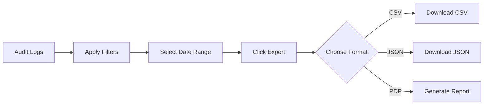

# NexusOS Admin Dashboard - UX Design Document

**Version:** 1.0  
**Date:** January 19, 2026  
**Project:** Go Clean Boilerplate (Casbin RBAC)  
**Design System:** Nexus Design System v1.0

---

## Table of Contents

1. [Design Philosophy](#1-design-philosophy)
2. [User Personas](#2-user-personas)
3. [Information Architecture](#3-information-architecture)
4. [Screen Inventory](#4-screen-inventory)
5. [Component Specifications](#5-component-specifications)
   - 5.1 [Density Variables](#51-density-variables-chameleon-engine)
   - 5.2 [Color Tokens](#52-color-tokens-nebula-palette)
   - 5.3 [Typography](#53-typography-geist-font-family)
   - 5.4 [Spacing System](#54-spacing-system)
   - 5.5 [Shadow System](#55-shadow-system-elevation)
   - 5.6 [Negative Space Guidelines](#56-negative-space-guidelines-breathing-room)
   - 5.7 [Empty States & Loading](#57-empty-states--loading-patterns)
6. [User Flows](#6-user-flows)
7. [Interaction Patterns](#7-interaction-patterns)
8. [Responsive Behavior](#8-responsive-behavior)
9. [Accessibility Requirements](#9-accessibility-requirements)

---

## 1. Design Philosophy

### Core Concept: "Fluid Density"

The NexusOS dashboard embodies a **dual-personality system** that adapts to user context:

| Mode        | Target User                   | Visual Character                 | Use Case                            |
| :---------- | :---------------------------- | :------------------------------- | :---------------------------------- |
| **Comfort** | Business Managers, New Users  | Spacious, friendly, soft shadows | Overview, onboarding, presentations |
| **Compact** | Technical Admins, Power Users | Dense, precise, grid lines       | Data analysis, bulk operations      |

### Design Pillars

1. **Clarity First** — Every element earns its place
2. **Progressive Disclosure** — Overview → Detail flow
3. **Density on Demand** — User controls information density
4. **SaaS Ready** — Multi-tenant architecture baked in

---

## 2. User Personas

### Persona A: Technical Administrator ("Alex")

> _"I need to see everything at once and act fast."_

- **Role:** System Administrator, DevOps
- **Goals:** Monitor system, manage permissions, debug issues
- **Preferred Mode:** Compact
- **Key Screens:** Audit Logs, Permission Matrix, User Grid
- **Behaviors:** Keyboard shortcuts, bulk actions, filtering

### Persona B: Business Manager ("Maya")

> _"Show me the important numbers and let me manage my team."_

- **Role:** Team Lead, Department Manager
- **Goals:** Manage team access, review activity, delegate roles
- **Preferred Mode:** Comfort
- **Key Screens:** Dashboard, User Cards, Role Overview
- **Behaviors:** Visual scanning, single actions, delegation

### Persona C: SaaS Builder ("Dev")

> _"I need a white-label admin template I can adapt to my product."_

- **Role:** Developer, Startup Founder
- **Goals:** Customize branding, extend functionality, integrate APIs
- **Needs:** Clean code, theming support, component library

---

## 3. Information Architecture

### Navigation Structure

```
📊 Dashboard (Home)
│
├── 👥 User Management
│   ├── User List (Hyper-Grid)
│   ├── User Detail (Card)
│   └── Create/Edit User (Form)
│
├── 🔐 Role Management
│   ├── Role List (Grid/Cards)
│   ├── Role Detail (Card)
│   └── Create/Edit Role (Form)
│
├── 🛡️ Access Control
│   ├── Permission Matrix (Grid)
│   ├── Policy Editor (Advanced)
│   └── Inheritance View (Tree)
│
├── 📋 Audit Logs
│   ├── Activity Stream (Hyper-Grid)
│   ├── Export Center
│   └── Analytics Dashboard
│
├── ⚙️ Settings
│   ├── Profile
│   ├── Preferences (Density, Theme)
│   └── API Keys
│
└── 🤖 AI Assistant (Dockable)
```

### URL Structure

| Screen      | Route        | Description       |
| :---------- | :----------- | :---------------- |
| Dashboard   | `/`          | Main overview     |
| Users       | `/users`     | User list         |
| User Detail | `/users/:id` | User profile      |
| Roles       | `/roles`     | Role list         |
| Role Detail | `/roles/:id` | Role config       |
| Permissions | `/access`    | Permission matrix |
| Audit Logs  | `/audit`     | Activity logs     |
| Settings    | `/settings`  | User preferences  |

---

## 4. Screen Inventory

### 4.1 Dashboard (Hybrid Layout)

**Purpose:** First-glance system health and quick actions

**Layout Zones:**

```
┌─────────────────────────────────────────────────────────────┐
│  NAVBAR                                                     │
├───────────┬─────────────────────────────────────────────────┤
│           │  ZONE A: KPI Metric Cards (4 cards)             │
│  SIDEBAR  ├─────────────────────────────────────────────────┤
│           │  ZONE B: Hyper-Grid (Recent Audit Logs)         │
│           ├─────────────────────────────────────────────────┤
│           │  ZONE C: Quick Actions Bar                      │
└───────────┴─────────────────────────────────────────────────┘
```

**Zone A - KPI Cards:**

| Card | Metric          | Icon            | Trend            |
| :--- | :-------------- | :-------------- | :--------------- |
| 1    | Total Users     | `Users`         | +12% (sparkline) |
| 2    | Active Roles    | `Shield`        | Static           |
| 3    | Today's Actions | `Activity`      | Live count       |
| 4    | Failed Logins   | `AlertTriangle` | Red if > 0       |

**Zone B - Recent Logs Grid (5 rows preview):**

| Time               | User          | Action     | Resource | Status       |
| :----------------- | :------------ | :--------- | :------- | :----------- |
| Relative timestamp | Avatar + Name | Verb badge | Path     | Status badge |

**Zone C - Quick Actions:**

```
[+ Add User]  [+ Create Role]  [📤 Export Logs]  [⚙️ Settings]
```

---

### 4.2 User Management

**Layout:** Full-width Hyper-Grid with toolbar

**Toolbar:**

```
[Search...]  [Filter ▼]  [Columns ▼]  [◐ Density]  [+ Add User]
```

**Grid Columns:**

| Column        | Type      | Sortable | Filterable |
| :------------ | :-------- | :------- | :--------- |
| Checkbox      | Selection | -        | -          |
| Avatar + Name | Text      | ✅       | ✅         |
| Email         | Text      | ✅       | ✅         |
| Role          | Badge     | ✅       | ✅         |
| Status        | Badge     | ✅       | ✅         |
| Created       | Date      | ✅       | ✅         |
| Actions       | Menu      | -        | -          |

**Row Actions (hover reveal):**

- View Profile
- Edit User
- Assign Role
- Deactivate
- Delete

---

### 4.3 Permission Matrix

**Layout:** Spreadsheet-style interactive grid

**Structure:**

```
┌─────────────────────────────────────────────────────────────┐
│  Permission Matrix                    [+ Role] [+ Resource] │
├───────────┬─────────┬─────────┬─────────┬─────────┬─────────┤
│   Role    │ /users  │ /roles  │ /audit  │/content │ /api/*  │
├───────────┼─────────┼─────────┼─────────┼─────────┼─────────┤
│ superadmin│  ████   │  ████   │  ████   │  ████   │  ████   │
│ admin     │  ███░   │  ██░░   │  ██░░   │  ████   │  ██░░   │
│ editor    │  █░░░   │  ░░░░   │  █░░░   │  ███░   │  █░░░   │
│ viewer    │  █░░░   │  ░░░░   │  █░░░   │  █░░░   │  ░░░░   │
└───────────┴─────────┴─────────┴─────────┴─────────┴─────────┘

Legend: █ = Enabled  ░ = Disabled
        C = Create  R = Read  U = Update  D = Delete
```

**Interactions:**

- Click cell → Toggle permission popup
- Click role → Opens Role Detail Card (slide-over)
- Hover row → Highlight entire row

---

### 4.4 Role Detail Card (Slide-over Panel)

**Trigger:** Click role row in Matrix or Role list

**Structure:**

```
┌─ Role: admin ─────────────────────────────────┐
│                                        [✕]    │
│  ┌──────────────────────────────────────────┐ │
│  │ Name: [admin________________]            │ │
│  │ Description: [Full system access_____]   │ │
│  │ Inherits from: [none ▼]                  │ │
│  └──────────────────────────────────────────┘ │
│                                               │
│  👥 Members (5)                    [+ Assign] │
│  ┌──────────────────────────────────────────┐ │
│  │ ○ john@example.com           [Remove]    │ │
│  │ ○ jane@example.com           [Remove]    │ │
│  │ ○ alex@example.com           [Remove]    │ │
│  └──────────────────────────────────────────┘ │
│                                               │
│  🔐 Permissions                               │
│  ┌─ /users ─────────────────────────────────┐ │
│  │ ☑ Read  ☑ Create  ☑ Update  ☐ Delete   │ │
│  └──────────────────────────────────────────┘ │
│  ┌─ /roles ─────────────────────────────────┐ │
│  │ ☑ Read  ☑ Create  ☐ Update  ☐ Delete   │ │
│  └──────────────────────────────────────────┘ │
│                                               │
│  [🗑️ Delete Role]            [💾 Save Changes] │
└───────────────────────────────────────────────┘
```

---

### 4.5 Audit Logs (Hyper-Grid)

**Purpose:** Comprehensive activity monitoring with enterprise-grade filtering

**Layout:**

```
┌─────────────────────────────────────────────────────────────┐
│  📋 Audit Logs                                              │
│  ─────────────────────────────────────────────────────────  │
│  [🔍 Search logs...]  [📅 Date Range]  [👤 User]  [📊 Action] │
│  [Columns ▼]  [◐ Comfort ● Compact]       [📤 Export ▼]     │
├───────────────────────────────────────────────────────────  │
│  ┌─────────────────────────────────────────────────────────┐│
│  │ Timestamp  │ User      │ Action  │ Resource  │ Status  ││
│  ├─────────────────────────────────────────────────────────┤│
│  │ 2m ago     │ ● john    │ CREATE  │ /users/5  │ ✓ OK    ││
│  │ 5m ago     │ ● jane    │ UPDATE  │ /roles/2  │ ✓ OK    ││
│  │ 12m ago    │ ● alex    │ DELETE  │ /users/3  │ ✓ OK    ││
│  │ 1h ago     │ ● system  │ LOGIN   │ /auth     │ ✗ FAILED││
│  └─────────────────────────────────────────────────────────┘│
│                                                             │
│  Showing 1-20 of 1,234 results    [← 1 2 3 ... 62 →]       │
└─────────────────────────────────────────────────────────────┘
```

**Action Badges (Color-coded):**

| Action | Color     | Description        |
| :----- | :-------- | :----------------- |
| CREATE | `emerald` | New record created |
| READ   | `slate`   | Record viewed      |
| UPDATE | `amber`   | Record modified    |
| DELETE | `red`     | Record removed     |
| LOGIN  | `indigo`  | Auth attempt       |
| EXPORT | `violet`  | Data exported      |

**Status Badges:**

| Status  | Color            | Visual   |
| :------ | :--------------- | :------- |
| Success | `emerald-subtle` | ✓ OK     |
| Failed  | `red-subtle`     | ✗ FAILED |
| Warning | `amber-subtle`   | ⚠ WARN   |

---

### 4.6 Authentication Screens

**Login Page (Split Layout):**

```
┌─────────────────────────┬─────────────────────────┐
│                         │                         │
│   [LOGO]                │                         │
│                         │   ┌─────────────────┐   │
│   Welcome Back          │   │                 │   │
│   Sign in to continue   │   │  3D Abstract    │   │
│                         │   │  Gradient BG    │   │
│   [Email____________]   │   │  + Noise        │   │
│   [Password_________]   │   │                 │   │
│   ☐ Remember me         │   └─────────────────┘   │
│                         │                         │
│   [Sign In ──────────]  │   "Trusted by 500+     │
│                         │    companies"          │
│   Forgot password?      │                         │
│   Don't have account?   │                         │
│                         │                         │
└─────────────────────────┴─────────────────────────┘
```

---

## 5. Component Specifications

### 5.1 Density Variables (Chameleon Engine)

| Component        | Comfort Mode | Compact Mode |
| :--------------- | :----------- | :----------- |
| Button Height    | 44px         | 32px         |
| Input Height     | 44px         | 32px         |
| Table Row        | 64px         | 36px         |
| Card Padding     | 24px         | 12px         |
| Border Radius    | 12px         | 4px          |
| Font Size (Body) | 14px         | 13px         |
| Icon Size        | 20px         | 16px         |
| Sidebar Width    | 280px        | 72px         |
| Navbar Height    | 80px         | 56px         |

### 5.2 Color Tokens (Nebula Palette)

| Token        | Light Mode | Dark Mode (Eclipse) |
| :----------- | :--------- | :------------------ |
| `background` | `#FFFFFF`  | `#020617`           |
| `surface`    | `#F8FAFC`  | `#0F172A`           |
| `border`     | `#E2E8F0`  | `#1E293B`           |
| `primary`    | `#6366F1`  | `#818CF8`           |
| `foreground` | `#0F172A`  | `#F8FAFC`           |
| `muted`      | `#64748B`  | `#94A3B8`           |

### 5.3 Typography (Geist Font Family)

| Style   | Size      | Weight   | Use             |
| :------ | :-------- | :------- | :-------------- |
| Display | 36px      | Bold     | KPI numbers     |
| H1      | 24px      | SemiBold | Page titles     |
| H2      | 20px      | SemiBold | Section headers |
| Body    | 14px/13px | Regular  | Content         |
| Small   | 13px/12px | Regular  | Labels          |
| Caption | 12px/11px | Medium   | Badges          |

### 5.4 Spacing System

**Base Unit:** `4px` — All spacing derives from this base unit.

**Spacing Token Scale:**

| Token      | Value | Use Case                       | Comfort | Compact |
| :--------- | :---- | :----------------------------- | :------ | :------ |
| `space-0`  | 0px   | No spacing                     | 0       | 0       |
| `space-1`  | 4px   | Tight inline elements          | 4px     | 2px     |
| `space-2`  | 8px   | Related elements (icon + text) | 8px     | 4px     |
| `space-3`  | 12px  | Form field gaps                | 12px    | 8px     |
| `space-4`  | 16px  | Section padding (small)        | 16px    | 12px    |
| `space-5`  | 20px  | Card internal padding          | 20px    | 12px    |
| `space-6`  | 24px  | Section gaps                   | 24px    | 16px    |
| `space-8`  | 32px  | Major section dividers         | 32px    | 20px    |
| `space-10` | 40px  | Page-level breathing room      | 40px    | 24px    |
| `space-12` | 48px  | Hero spacing                   | 48px    | 32px    |
| `space-16` | 64px  | Major layout gaps              | 64px    | 40px    |

**Application Guidelines:**

```
┌─────────────────────────────────────────────────────────────────────┐
│  ← space-6 (24px) page margin                                       │
│    ┌─────────────────────────────────────────────────────────────┐  │
│    │  ← space-5 (20px) card padding                              │  │
│    │                                                             │  │
│    │   Title                     ← space-2 (8px) title-content  │  │
│    │   ────────────────────                                      │  │
│    │   Content line 1            ← space-1 (4px) line-to-line   │  │
│    │   Content line 2                                            │  │
│    │   Content line 3                                            │  │
│    │                             ← space-4 (16px) section gap   │  │
│    │   [Button]  [Button]        ← space-2 (8px) button gap     │  │
│    │                                                             │  │
│    └─────────────────────────────────────────────────────────────┘  │
│         ↓ space-4 (16px) card-to-card gap                           │
│    ┌─────────────────────────────────────────────────────────────┐  │
│    │   Another Card                                              │  │
│    └─────────────────────────────────────────────────────────────┘  │
│                                                                     │
└─────────────────────────────────────────────────────────────────────┘
```

### 5.5 Shadow System (Elevation)

Shadows indicate elevation and interaction state. Follows a consistent scale.

**Shadow Token Scale:**

| Token          | Definition                         | Use Case                    |
| :------------- | :--------------------------------- | :-------------------------- |
| `shadow-none`  | `none`                             | Flat elements, borders only |
| `shadow-xs`    | `0 1px 2px rgba(0,0,0,0.04)`       | Subtle lift (buttons hover) |
| `shadow-sm`    | `0 1px 3px rgba(0,0,0,0.08)`       | Cards resting state         |
| `shadow-md`    | `0 4px 6px rgba(0,0,0,0.10)`       | Cards on hover              |
| `shadow-lg`    | `0 10px 15px rgba(0,0,0,0.12)`     | Modals, popovers            |
| `shadow-xl`    | `0 20px 25px rgba(0,0,0,0.15)`     | Command Palette, overlays   |
| `shadow-2xl`   | `0 25px 50px rgba(0,0,0,0.20)`     | Full-screen modals          |
| `shadow-inner` | `inset 0 2px 4px rgba(0,0,0,0.06)` | Input focus (subtle)        |

**Dark Mode Adjustments:**

In dark mode (`Eclipse`), shadows are de-emphasized and borders are used instead:

| Element | Light Mode  | Dark Mode                             |
| :------ | :---------- | :------------------------------------ |
| Card    | `shadow-sm` | `border border-slate-800`             |
| Hover   | `shadow-md` | `border-2 border-indigo-500/30`       |
| Modal   | `shadow-xl` | `shadow-lg + border border-slate-700` |

**Component Shadow Assignment:**

| Component         | Resting     | Hover       | Active        |
| :---------------- | :---------- | :---------- | :------------ |
| Card              | `shadow-sm` | `shadow-md` | —             |
| Button (primary)  | `shadow-xs` | `shadow-sm` | `shadow-none` |
| Dropdown          | `shadow-lg` | —           | —             |
| Modal             | `shadow-xl` | —           | —             |
| Toast             | `shadow-lg` | —           | —             |
| Tooltip           | `shadow-md` | —           | —             |
| Sidebar (docked)  | `shadow-lg` | —           | —             |
| Table Row (hover) | —           | `shadow-xs` | —             |

**Visual Hierarchy Illustration:**

```
          ▲ Elevation
          │
shadow-xl ├───────────────────────────────┐
          │        Modal / Command        │
          │                               │
shadow-lg ├─────────────────────┐         │
          │    Dropdown Menu    │         │
          │                     │         │
shadow-md ├───────────┐         │         │
          │ Card Hover│         │         │
          │           │         │         │
shadow-sm ├─────┐     │         │         │
          │Card │     │         │         │
          │     │     │         │         │
shadow-xs ├─┐   │     │         │         │
          │Btn│   │     │         │         │
──────────┴─┴───┴─────┴─────────┴─────────┴──► Components
         Button Card  Card    Dropdown  Modal
                     (hover)
```

### 5.6 Negative Space Guidelines (Breathing Room)

Negative space (white space) is intentionally left empty to improve visual hierarchy, readability, and focus.

**Principles:**

| Principle                 | Implementation                                      |
| :------------------------ | :-------------------------------------------------- |
| **Law of Proximity**      | Related items grouped with `space-2`—`space-3`      |
| **Separation**            | Unrelated sections separated by `space-6`+          |
| **Content Density Zones** | Dense data (grid) vs. Spacious overview (dashboard) |
| **Respite Areas**         | Leave empty zones for visual rest                   |

**Breathing Room Zones:**

```
┌─────────────────────────────────────────────────────────────────────┐
│                                                                     │
│   ┌─ HEADER ZONE ─────────────────────────────────────────────────┐ │
│   │   Page Title                                                  │ │
│   │   Subtitle / Breadcrumb                                       │ │
│   └───────────────────────────────────────────────────────────────┘ │
│                          ← space-8 (32px) BREATHING ZONE            │
│   ┌─ CONTENT ZONE ────────────────────────────────────────────────┐ │
│   │                                                               │ │
│   │   Dense data table or form content                            │ │
│   │                                                               │ │
│   └───────────────────────────────────────────────────────────────┘ │
│                          ← space-6 (24px) BREATHING ZONE            │
│   ┌─ ACTION ZONE ─────────────────────────────────────────────────┐ │
│   │   [Cancel]                 [Save Changes]                     │ │
│   └───────────────────────────────────────────────────────────────┘ │
│                                                                     │
└─────────────────────────────────────────────────────────────────────┘
```

**Adaptive Negative Space (Density Modes):**

| Zone              | Comfort Mode | Compact Mode | Notes                  |
| :---------------- | :----------- | :----------- | :--------------------- |
| Page Margin       | 32px         | 16px         | Outer breathing room   |
| Header ↔ Content  | 32px         | 16px         | Separation after title |
| Card ↔ Card       | 24px         | 12px         | Inter-card spacing     |
| Section ↔ Section | 40px         | 24px         | Major content blocks   |
| CTA Area Above    | 24px         | 16px         | Space before actions   |

**Empty State Negative Space:**

Empty states should have generous negative space to feel inviting, not cramped:

```
Comfort Mode Empty State:

┌─────────────────────────────────────────────────────────────────────┐
│                        ← space-16 (64px) top margin                 │
│                                                                     │
│                    ┌───────────────────┐                            │
│                    │                   │                            │
│                    │   Illustration    │  ← 120px × 120px minimum   │
│                    │                   │                            │
│                    └───────────────────┘                            │
│                                                                     │
│                        ← space-6 (24px) gap                         │
│                                                                     │
│                     Title text                                      │
│                        ← space-2 (8px) gap                          │
│                     Description text                                │
│                        ← space-6 (24px) gap                         │
│                     [Primary CTA Button]                            │
│                                                                     │
│                        ← space-16 (64px) bottom margin              │
└─────────────────────────────────────────────────────────────────────┘
```

### 5.7 Empty States & Loading Patterns

Refer to the dedicated [empty-states.md](./empty-states.md) wireframe for complete empty state designs.

**Empty State Components:**

| Element          | Requirement                                        |
| :--------------- | :------------------------------------------------- |
| **Illustration** | 80-120px, subtle tones (slate), Lottie if animated |
| **Title**        | Clear, actionable heading (e.g., "No users yet")   |
| **Description**  | Explains why empty + what to do (1-2 sentences)    |
| **Primary CTA**  | One main action button                             |
| **Secondary**    | Optional link or alternative action                |

**Loading Skeleton Rules:**

| Data Type  | Skeleton Pattern                    |
| :--------- | :---------------------------------- |
| Text line  | `▓▓▓▓▓▓▓▓░░░░░░` (60-70% width)     |
| Avatar     | Circle shimmer                      |
| Badge      | Small rounded rect shimmer          |
| Table row  | Full row skeletal structure         |
| Card       | Card outline with internal shimmers |
| KPI number | Large text block shimmer            |

**Shimmer Animation:**

````css
/* Shimmer animation specification */
@keyframes shimmer {
  0% { background-position: -200% 0; }
  100% { background-position: 200% 0; }
}

.skeleton {
  background: linear-gradient(90deg,
    var(--slate-200) 0%,
    var(--slate-100) 50%,
    var(--slate-200) 100%
  );
  background-size: 200% 100%;
  animation: shimmer 1.5s infinite;
}


## 6. User Flows

### 6.1 Add New User Flow

```mermaid
flowchart LR
    A[User List] --> B[Click + Add User]
    B --> C[User Form Modal]
    C --> D{Fill Details}
    D --> E[Assign Role]
    E --> F[Save]
    F --> G{Validation}
    G -->|Pass| H[Success Toast]
    G -->|Fail| I[Show Errors]
    H --> J[Return to List]
    I --> D
````

### 6.2 Manage Role Permissions Flow

```mermaid
flowchart LR
    A[Access Control] --> B[Permission Matrix]
    B --> C[Click Role Row]
    C --> D[Role Detail Slide-over]
    D --> E[Toggle Permissions]
    E --> F[Add/Remove Members]
    F --> G[Save Changes]
    G --> H[Matrix Updates]
```

### 6.3 Export Audit Logs Flow



---

## 7. Interaction Patterns

### 7.1 Keyboard Shortcuts

| Shortcut             | Action              |
| :------------------- | :------------------ |
| `Ctrl/⌘ + K`         | Open Command Menu   |
| `Ctrl/⌘ + /`         | Toggle AI Assistant |
| `Ctrl/⌘ + D`         | Toggle Density Mode |
| `Ctrl/⌘ + Shift + D` | Toggle Dark Mode    |
| `Escape`             | Close modal/panel   |

### 7.2 Toast Notifications

| Type          | Position (Comfort) | Position (Compact) | Duration        |
| :------------ | :----------------- | :----------------- | :-------------- |
| Success       | Top-right          | Bottom-right       | 3s auto-dismiss |
| Error         | Top-right          | Bottom-right       | Persistent      |
| AI Processing | Top-right          | Bottom-right       | Until complete  |

### 7.3 Loading States

| Component   | Loading Pattern       |
| :---------- | :-------------------- |
| Page        | Skeleton shimmer      |
| Table       | Row skeleton (5 rows) |
| Button      | Spinner + disabled    |
| Card        | Pulse animation       |
| AI Response | Shimmer gradient      |

---

## 8. Responsive Behavior

### Breakpoints

| Breakpoint | Width   | Layout Changes                           |
| :--------- | :------ | :--------------------------------------- |
| Desktop XL | ≥1440px | Full features, sidebar expanded          |
| Desktop    | ≥1024px | Full features, sidebar collapsible       |
| Tablet     | ≥768px  | Sidebar hidden (drawer), simplified grid |
| Mobile     | <768px  | Single column, bottom nav, stacked cards |

### Mobile Adaptations

- **Sidebar** → Bottom navigation bar
- **Hyper-Grid** → Responsive cards or horizontal scroll
- **Permission Matrix** → Swipeable columns or accordion
- **Modals** → Full-screen sheets
- **Quick Actions** → FAB (Floating Action Button)

---

## 9. Accessibility Requirements

NexusOS targets **WCAG 2.1 Level AA** compliance for enterprise environments.

### 9.1 Perceivable

| Requirement          | Implementation                                                          |
| :------------------- | :---------------------------------------------------------------------- |
| **Color Contrast**   | Minimum 4.5:1 for text, 3:1 for UI components                           |
| **Focus Indicators** | 2px solid primary color ring on all interactive elements                |
| **Text Resizing**    | UI remains functional at 200% zoom                                      |
| **Alt Text**         | All decorative icons marked `aria-hidden`, functional icons have labels |
| **Motion Reduction** | Respect `prefers-reduced-motion` for animations                         |

### 9.2 Operable

| Requirement             | Implementation                                          |
| :---------------------- | :------------------------------------------------------ |
| **Keyboard Navigation** | Full keyboard access via Tab, Arrow keys, Enter, Escape |
| **Skip Links**          | "Skip to main content" link visible on focus            |
| **Focus Trapping**      | Modals and dialogs trap focus within until closed       |
| **Touch Targets**       | Minimum 44×44px in Comfort mode, 32×32px in Compact     |
| **No Keyboard Traps**   | Escape always closes overlays                           |

### 9.3 Understandable

| Requirement               | Implementation                                          |
| :------------------------ | :------------------------------------------------------ |
| **Error Messages**        | Clear, descriptive error text linked to form fields     |
| **Labels**                | All inputs have visible labels (not placeholder-only)   |
| **Consistent Navigation** | Sidebar and navbar remain in same position across pages |
| **Predictable Behavior**  | No unexpected context changes on focus/input            |

### 9.4 Robust

| Requirement               | Implementation                                                    |
| :------------------------ | :---------------------------------------------------------------- |
| **Semantic HTML**         | Use `<nav>`, `<main>`, `<aside>`, `<button>`, `<table>` correctly |
| **ARIA Landmarks**        | `role="navigation"`, `role="main"`, `role="dialog"` as needed     |
| **Screen Reader Testing** | Verified with NVDA, VoiceOver, JAWS                               |
| **Accessible Tables**     | `<th scope="col">` headers, `aria-sort` for sortable columns      |

### 9.5 Component-Specific Requirements

**Hyper-Grid (Data Table):**

- Announce row count: `aria-rowcount`, `aria-colcount`
- Live region for row selection changes
- Column sort announced via `aria-sort`
- Filter/search announces result count

**Permission Matrix:**

- Cell toggles have clear `aria-label` (e.g., "Enable Read for admin on /users")
- Role detail panel uses `role="dialog"` with `aria-labelledby`

**AI Chat:**

- New messages announced via `aria-live="polite"`
- Input has `aria-label="Message to AI assistant"`
- Processing state uses `aria-busy="true"`

**Toasts:**

- Use `role="alert"` for errors, `role="status"` for success/info
- Auto-dismiss toasts have "Dismiss" button for keyboard users

---

## Appendix: Design System References

- [Nexus Design System Readme](../design/readme.md)
- [Color Palette (spekui.md)](../design/spekui.md)
- [Dark Mode Specs (spekui-dakmode.md)](../design/spekui-dakmode.md)
- [Atomic Components](../design/atoms.md)
- [Typography System](../design/tipografi.md)
- [Iconography](../design/iconography.md)

---

_Document created by Sally, UX Designer Agent_  
_Nexus Design System v1.0 - "Fluid Density"_
